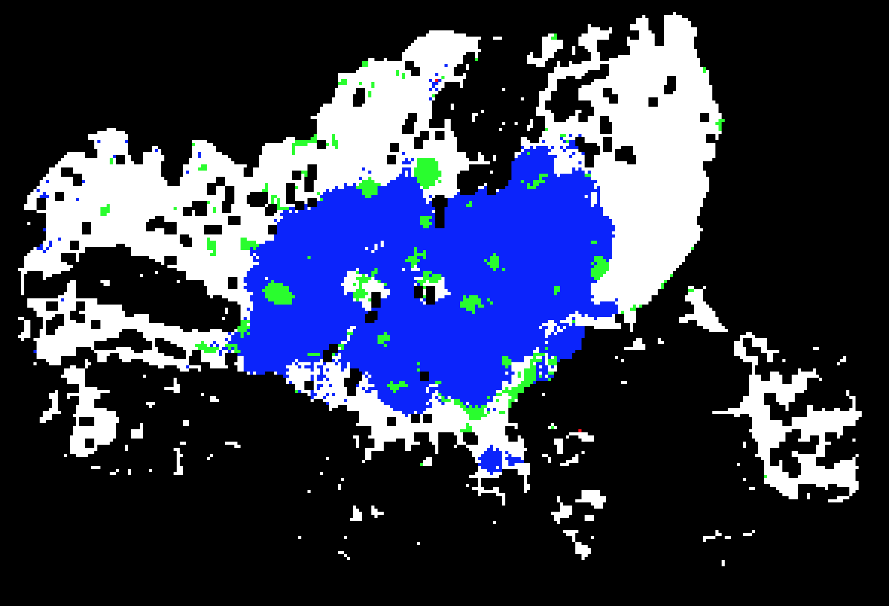

## Breast Cancer Image Classification On WSI With Spatial Correlations



This project aims at providing a more reliable result for WSI using a two step framework based on CNN and LR.

As common cancer, breast cancer kills thousands of women every year.
It's significant to provide doctors computer-aided diagnosis (CAD) to ease their workload as well as improve detection quality. Patch-level CNNs are usually used to classify the breast tissue slice, and the CNNs classify each patch independently ignoring the spatial correlations, resulting in wrong isolated label map. However, the probability distribution of cancer type is related to their adjacent patches. In this paper, we propose a framework integrating CNN and filter algorithm aimed at extracting spatial information and improving the performance of the classification. The network was trained on a breast cancer dataset provided by ICIAR18. For 4-class classification, compared to CNN methods without using spatial correlations, the proposed method achieved about 10\% improvement on accuracy over the validation dataset and get smoother probability maps. Our experiments also show that larger kernel size gets better performance.

## Highlights

- more fexible
- easy to achieve
- less computation cost

## Citations

this project is the implementation of our work "Breast Cancer Image Classification on WSI with Spatial Correlations",  Please consider citing this project in your publications if it helps your research. The following is a BibTeX reference:

```
@inproceedings{ye2019breast,
  title={Breast Cancer Image Classification on WSI with Spatial Correlations},
  author={Ye, Jiandong and Luo, Yihao and Zhu, Chuang and Liu, Fang and Zhang, Yue},
  booktitle={ICASSP 2019-2019 IEEE International Conference on Acoustics, Speech and Signal Processing (ICASSP)},
  pages={1219--1223},
  year={2019},
  organization={IEEE}
}
```
